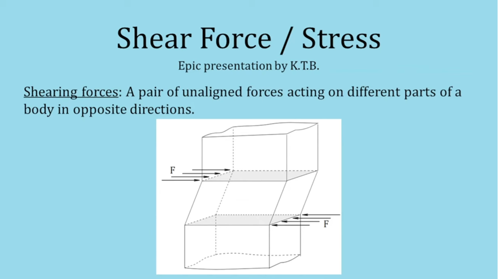
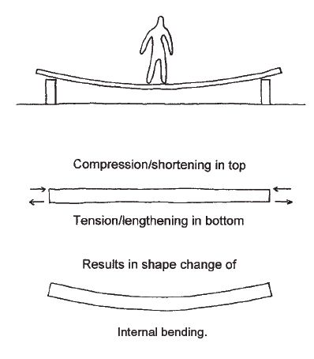
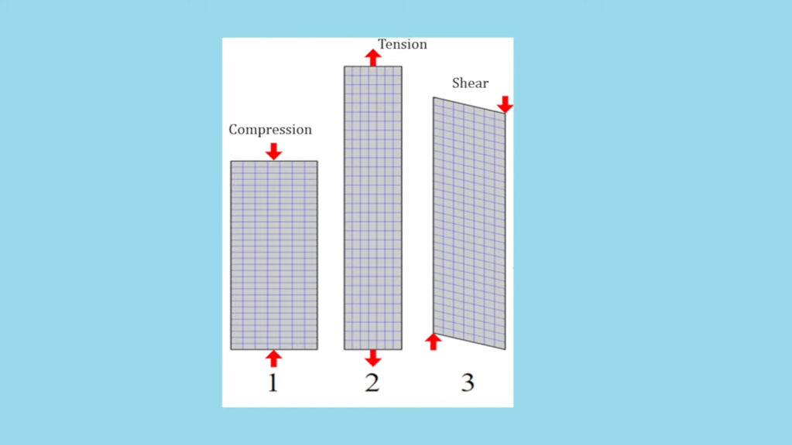
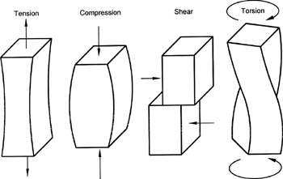

# Basic elements

## Columns
When we discuss structural mechanics in buildings, the first question is how loads act on the structure and how the structure carries them. Consider the simplest case: two columns with a slab placed on top, and a load on the slab. The slab will bend because the load is usually not applied exactly above a column. If the load is closer to a column, the slab bends less because more of the weight is directly carried by the column itself. If the load is at the middle between the columns, the bending is the largest — this is intuitive.

If that bending exceeds what the slab material can tolerate, the slab will crack or break. One way to reduce bending is to add additional columns between the original two. That is why structural design requires estimating how much load the slab must support, and deciding how many columns are needed.

## Wall
The strongest possible structure between two columns is to add infinitely many columns in between, meaning every point is directly supported. Then the slab does not bend at all. Those “infinite columns” are what we call a wall.

The same idea extends to 3D: suppose we have four columns forming the corners of a square and a floor (slab) on top. The floor will bend under loads unless the load is placed exactly above a column. The absolutely strongest possible structure would be to fill the entire space between the four columns with material — forming a solid cube. In that case every point of the floor is supported and there is no bending problem. But this is not a good design: (1) we lose all usable interior space, and (2) we waste enormous material. So designers must balance structural strength, interior usable space for people, and cost.

## Beam
A beam is a smart compromise that saves material and still strengthens the slab.

Since a slab bends, and we want the space below it to be free for living or walking, we cannot just keep adding columns. Another idea is to make the slab thicker so it can tolerate more bending. That would work, but in modern buildings this would make the structure unnecessarily heavy and wasteful. Instead of thickening the entire slab, we only thicken the edges where the bending is most critical. In 3D, the slab is a floor, and the local thickening along its edges is exactly what we call a beam. A beam is therefore literally the slab’s “reinforced edge” that controls bending without filling the space below with columns or making the whole slab massive.

## Bending force and shear force
We have now discussed the basic structural elements but didn't have a strong concepts about how we precisely decide what is a material bending really is. We need to define what bending force of a slab or floor is.

Intuitively, the bending situation is that a slab bar which have some weighted load on it would be pressed on the top and stretch under the bottom part. In short, the top would tend to get shorter and the bottom would tend to get longer(You can imagine this by bending a solid metal bar by your hands).

In the classical **Euler-Bernoulli Beam theory**(the standard model used in basic structural mechanics), two key assumptions are made
1. Plane sections remain plane, means: 
 - Cross-section of the beam do not warp - they rotate as rigid pieces
2. The neutral axis(center line of the beam) has no change in length, means:
 - Fibers above the neutral axis shotten(compression)
 - Fibers below the neutral axis lengthen (tension)
 - The neutral axis itself neither stretches nor compresses

At this point, a natural definition of the bending force on any position of a slab(a 3d-solid horizontal bar) is 
```math
\sigma = \dfrac{M \cdot y}{I}
```
 - M is the bending moment, roughly the rotational torque of the slab caused by the load.
 - y is the distance of the position's axis(fiber) and the central axis
 - I is the moment of inertia of cross-section. This parameter is paired to M, means how well the cross-section can resist bending. Like rotational inertia.

According to this definition, bending force $\sigma$ would be positive above the central axis, and negative under the central axis which is the **compression** and **tension**. (The positive or negative would based on the reference choose. So it could be negative above and positive down but the idea is the same)

Before we talk more detailed about bending force, we need to clarify three elementary forces.
[reference](https://mechanicalc.com/reference/beam-analysis)

### Compression(bending force)
A pair of equal and opposite forces pushing toward each other along the same line. (so the body is being squeezed). Calculuted by $\sigma$ which is a **stress** which is force per area.
### Tension(bending force)
A pair of equal and opposite forces pulling away from each other along the same line. (so the body is being pulled apart). Calculated by $\sigma$ which is a **stress** which is force per area.
### Shear(shear force)
A pair of equal and opposite forces acting parallel but not collinear (i.e. along different lines in parallel planes). (so the body tends to slide one layer over the other). It's also a stress which is force per area.

<p align="center">
  
</p>

<p align="center">
  
</p>

<p align="center">
  
</p>

[reference](https://www.youtube.com/watch?v=CVno4aJjMuc)

Basically, compression and tension is the result of bending moment. A slab is a 3 dimensional bar, the position on it would have different bending force which may be compression or tension. If we integral all the area with tension(or compression) across the section, we get moment of bending:
```math
M = \int_A{\sigma y dA}
```
Similarly, for shear force:
```math
V = \int_A{\tau dA}
```
 - $\tau$ is shear stress at a point
 - $dA$ is the area of the slice over which shear acts

The different part is that V is not moment but a force.

We have already told how bending force is caused by the weight of the load. The shear force is exactly caused by the weigt of the load too! 

In fact, bending force and shear force are just two different angles of view to describing how weight load got supported. If we have a load on the slab, the shear force we analysis would be caused by the columns and position that handle the load.

In the other hand, bending force is supporting the load through bending moment. Shear and bending are just two different ways to explain how the load getting support by different physical point of view. We can have the relation below:
```math
V\left(x\right) = \dfrac{dM\left(x\right)}{dx}
```
This means shear force is the derivative of the bending moment.

If we totally ignore material properies including material strength, deformation limits and failure modes(like cracking, yielding, buckling). Then shear force and bending moment are just different mathematical expressions of how a structure internally balances external loads. You can derive one from the other, so they are interchangeable in terms of describing the internal response.

However, in real world, material often tolerate bending better than shear. Shear stress and bending stress act in different directions and affect different failure modes. If we want a more save and precise design of building, we need to consider both factors.

We often use **shear force and bending moment diagram** which is build on the mathematical truth that bending and shear, one can be derived from the other, assuming the loading conditions are known.

The diagram is useful because, mainly, we design building structure by using shear and moment diagram to consider what material is suitable to use for the reasons that some material is better at some critical points in different shear-moment situation.

Roughly, a designer start his design from some artistic concept including building shape, column placement and spacing and open spaces, curves, cantilevers, etc. These choices express aesthetic, cultural, or functional ideas. And then the designer of course need to translate the vision ideas into something that can physically stand. For example, where loads will be applied, how forces will travel through the structure and what kind of structural system fits the shape(eg., frame, shell, truss). And then use shear and moment diagram to analysis critical point of internal force, understand how the structure will respond to gravity, wind, earthquakes, etc and detrmine where the structure needs to be strongest. Finally based on all of that, the choose the materials.

## Torsion(扭力)
We have already talk about **Compression**, **Tension**, **Shear**. (bending is just a combination of compression and tension). These three forces and the fourth one **Torsion** are the **Four Fundamental Internal Forces in Structural Mechanics**. 

<p align="center">
  
</p>

Almost every other kind of internal force or stress pattern in a structure can be understood as a combination or variation of these four. For examples:
 - Bending: Tension+Compresion(Top compresses, bottom stretches)
 - Buckling: Compression+Geometry(Instability under axial load)
 - Fatigue: Repeated Tension/Compression/Shear(Damage over time)
 - Torsional Shear: Shear+Rotation(Shear stress from twisting)
 - Thermal Stress: Tension/Compression(Caused by temperature change)
 - Combined Loading: Mix of all(Real-world loads often involve multiple)
