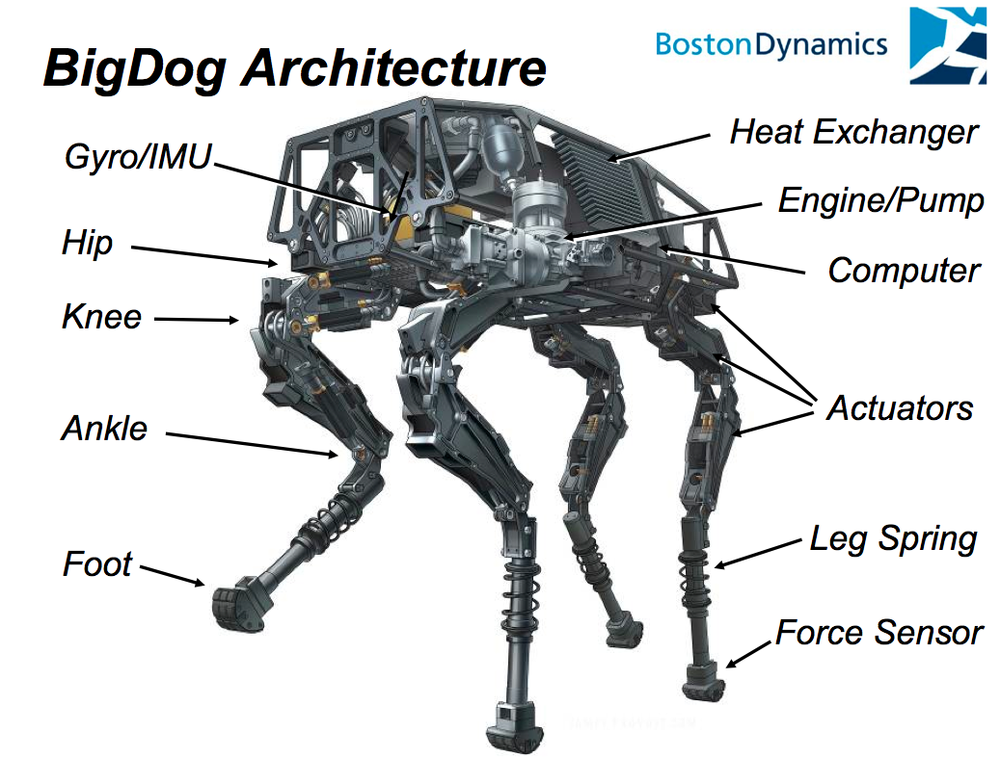

# Reference
You need to study about "Open source robotics"

# battery
Here's a [reference](https://www.youtube.com/watch?v=f_dtnhtmKt4) talks about how modern batteries works with battery modules set. The batteries used in laptops or even Electric Vehicles(like Telsa) are indeed use those small cylinder batteries that are commonly used in flashlight and TV controller, they are just moduled to a bigger pack to use in electric vehicle and laptop battery. What Elon Must have done is that he make batteries pack more efficient than before and makes Electric Vehicles has ability to versus traditional vehicles.

For robots, the battery life(how long a device can operate on a single charge and how long the battery remains effective over time.) is often very short, for example, a robot dog, the average battery life is probably around 4 hours.

Here's another [reference](https://www.youtube.com/watch?v=hBbhevHZZ5E) practically shows batteries of those things.

Here's a [dude trying to DIY build a battery pack(management system)](https://www.youtube.com/watch?v=rT-1gvkFj60)

Here's another [introduction](https://www.youtube.com/watch?v=q4wDa_m9-8E) talks about Battery Management System

# Motor
Mostly, for simple motors, we give powers to it, and it moves, without power, then it slow down because of friction. But for something that need accurate control system, we use **servo** motor(or servo system) which means the motors have feedback sensor that would tell the system the position and speed of it and system would make decision if the position or speed is right or not. If it is not right, then system would send command to rise the power of motor or low down of it to adjust the position or speed. Those servos are not just use in robotics but also used in industry robotic arm and satellite receiving antenna's rotational motor.

# Engine
Generally speaking, "engine" is any system that takes input energy or resources and produces useful output work. Such like game engine, search engine, combustion engine(mostly for vehicle). So, A motor is actually one kind of it, it's electricity input and rotational toque output.

# Robotic design example

  

# Satellite
The process to build a satellite, [reference](https://www.youtube.com/watch?v=5voQfQOTem8)
