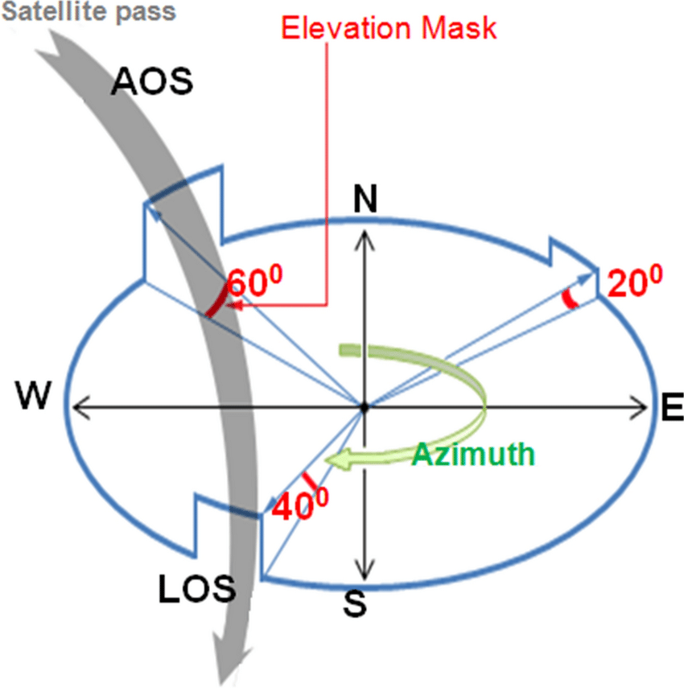

# Databases
  - soss資料庫: 專門放排程紀錄的資料庫, 他把從以前至今所有的排程紀錄都存入了, 並且會依照orbitron的軌道預測(輸出後在匯入soss)後10天的排程, 但那只是大致預測, 實際上的接收排程要依照接收的實際排程, VB排程程式會把當日的正確排程輸進soss資料庫, 並把多餘的排程紀錄(orbitron自動生成)從資料庫刪除. Orbitron的軌道參數現在會擋IP央大的IP, 所以要透過其他方式(我之前是透過VPN)繞過.  以下是接收站按照soss資料庫的排程紀錄用web前端列出接收排程: [接收排程](http://140.115.109.136/Web/Schedule/Default.aspx)
  - csrsr資料庫:

  - AOS_TIME: Acquisition of signal time, 表示開始有訊號(不是資料)的時間. 其實就是接收器開始可以看到衛星的時間
  - LOS_TIME: Loss of signal time, 表示失去信號的時間, 其實就是接收器無法看到衛星的時間
  - BR_TIME: Begin Reception, 真正衛星放資料的時間
  - ER_TIME: End Reception, 真正衛星停止放資料的時間

# Database Connection methods
  - Oracle 使用TNS(設定檔案在tnsnames.ora). 需要注意的是, oracle 相較於Mysql及sql server有個特別的地方, 就是你用不同的使用者登入同一個資料庫, 你會發現data tables完全不同, 這是正常的, 因為oracle的設計就是一個user對應一個schema. 在Mysql 和sql server中, 不同使用者登入同一個資料庫, 會看到一樣的data tables, 頂多權限不同. 目前測試環境有兩組帳號密碼: 
    - csrsr/csrsr123@140.115.109.204:1521/csrsrdb 
    - soss/csrsr123@140.115.109.204:1521/csrsrdb 
  - 兩個帳號登入後, 看到的table list不會一樣. soss 帳號是專門給排程用的. 然後database query gui我覺得dbeaver很不錯. 另外正式環境的帳號密碼為
    - soss/csrsr123@140.115.109.103:1521/csrsrdb
  - MySQL使用.my.cnf
  - SQL Server使用ODBC

# 以些重要的可能會使用到的名詞
 - BER(Bit error rate): Measures the accuracy of data transmission in any digital communication system. It's used in satellite signal links. But it's also not just for satellite receiving, but also wireless networks, Fiber-optic communication, a lot. It's universal metric in digital communications, not just satellites.  Mostly, it's influenced by, **Noise and interface**, **Signal-to-Noise-ratio(SNR)**, **Modulation and coding**, **Error correction techniques**. It has a deely relationship with modulations(QPSK, 16-QAM, etc). It's very often to encounter this value when you are correcting the receiving precision or accuracy.
 - ACU(Antenna Control Unit): Which is the equipment (hardware + control software) responsible for:
    - Pointer the antnenna toward the satellite
    - Tracking the satellite as it moves (especially for LEO satellites)
    - Controlling azimuth/elevation motors
    - Using TLE or sensor feedback to keep the antenna aligned
    - Handling auto-tracking, 
    - stow(to put something away neatly and securely in its proper place. for antenna, it means, move the antenna to a safe, parked position)
    - calibration(similar as "align" but in english, the meanings are still difference), for examples:
        1. Calibrate a scale → adjust it so “0 kg” is really 0 kg.
        2. Calibrate a thermometer → make sure its temperature reading is accurate.
        3. Calibrate a camera → tune settings so colors or focus are correct.
        4. Calibrate your expectations → adjust your thinking so it matches reality. (Metaphorical use)
        5. limits, and safety interlocks
        6. Communicating with other systems (RF equipment, receivers, scheduling software)

# 國家太空中心檔案
  - 國家太空中心(台灣的)本來叫做NSPO, 20230101後改為TASA, 所以你看舊的VB排程的code裡面只有NSPO, 但是較新的VB排程code只有TASA.  目前TASA的FS5接收檔與PHR和SPOT都不同, 採用PBK_FILENAME_yyyymmdd_A_TASA.TXT和PBK_FILENAME_yyyymmdd_B_TASA.TXT, 兩種檔案結構完全一樣, 之所以分AB, 很可能是怕檔案互相覆蓋, 因為你觀察會發現, 一個PBK檔案, 只會有某天的一個時段的接收, 而不會有該天的兩個時段, 例如2025/119-14:42:34~14:47:37, 則該檔案不會出現再同一天其他時段的接收紀錄, 例如2025/119-02:54:21~02:59:53是不會出現的, 但是可以出現2025/120-的某時段紀錄

# 接收工作的解析
  - 目前接受中心的電腦主機(第一排的電腦), IP-144主要用來存取放大天線(GSC1)的衛星接收數據, IP-164主要用來存放小天線(GSC2)的衛星接收數據, 理論上你會用Apecture(應該是TASA的軟體, 據說是要用java去登入?)這個軟體去分別去檢視IP-144(存放大天線數據)和IP-164(存放小天線數據)兩個電腦的接收情況, 
  - FS5的數據主要給TASA使用, TASA沒有授權太遙中心解密FS5數據, 所以我們這邊只有衛星的rough數據, 而沒辦法看到解密後的衛星數據(其實就是衛星拍攝的影像). 而Pleida的數據我們自己要解密(得到真實的圖像數據), 解密工作不是我們這一組的.
  - PCM主機(接收訊號後解調的機器)主要用於衛星接收數據時顯示解調的波型, 目前是IP-100(一樣透過遠端連接過去)的主機, 同時會開啟, HDR1(IP-140.115.109.163)以及HDR2(IP-140.115.109.130)的遠端, HDR1及HDR2可以顯示波型.
  - Pleida的接收數據需要另外解密(有被授權), 不是由Apecture軟體(IP-144及164)接收, 第一排最右邊的電腦是處理Pleida的電線情況的電腦. Pleida的接收軟體好像是Airbus(一家歐洲航天公司)吧
    - 後來稍微了解了一下, Pleida和spot都是Airbus歐洲最大的航空公司所主導, 接受站這裡成為了Airbus的DRS(Direct Receiving Station)之一, 為了方便對Pleida和spot衛星進行排程之類的控制, 同時我們這裡也有買Airbus的terminal(這在操作上, 主要是用來下單用的), 所謂的PCM(接收站這裡使用的)也是跟Airbus買的, 這好像是因為要成為Airbus的一員, 就要使用他們的PCM(用來控制多台解調器), 當然他們PCM也能控制不同的非airbus的解調器(如上面講的HDR1, HDR2, HDR3等等) 
  - 各接收工作用主機(電腦上有稍微貼紙表示主機名稱和代號): 
    - GSC1(140.115.109.41), 操作大天線的接收, 同GSC2的情形, 桌面會有GSC軟體(用來控制天線的轉動動作和監控天線的狀態, 包含你可以terminal任務, 可以執行到一半中斷), 總體基本操作與GSC2差不多
    - GSC2(140.115.109.43), 操作小天線的接收, 介面會顯示小天線的接收排程時間以及小天線的三個軸的當前角度(如果開始接收, 角度的數字就會開始跳動, 它顯示開始接收的時間, 是採用標準時間(第0時區). 
    - PCM(192.168.10.100), 連接HDR1(3個頻道可用), HDR2(只2個頻道可用, 機型較老舊), HDR3(3個頻道可用).   目前FS5(波型只需一個頻道即可, 但我們用兩個頻道去做他, 算是以防萬一)的數據同時給HDR1及HDR2解調, 而Pleida的數據(波型有3個波峰, 所以至少需要解調器有三個頻道)給HDR1及HDR3同時進型解調(同時給兩個也是為了以防萬一)
      - HDR1(140.115.109.163), 用來解調, 有3個channel
      - HDR2(140.115.109.130), 用來解調, 只有2個channel
      - HDR3(140.115.109.151), 用來解調, 有3個channel
    - vb程式排程電腦(140.115.109.42), 在前排電腦的好像第二個位置吧, 基本主要功能就是拿來執行VB排程程式


# Orbitron中, 有關衛星接收技術常見英文術語 
  [reference](https://tieba.baidu.com/p/771066249)
  - Azimuth(azm, 即平面上的"方位", 方位角)
<p align="center">
  
</p>
  - Elevation(elv, 即仰角)
<p align="center">
  
</p>
  - Range(接受站與衛星距離, 通常單位為公里)
  - S.Azm(把太陽當成衛星, 其方位角)
  - S.Elv(把太陽當成衛星, 其仰角)

# TLE(Two Line Element)
TLE範例
```
SCD 1                   ← 衛星名稱（可選）
1 22490U 93009B   25107.73936666  .00000668  00000+0  13238-3 0  9998
2 22490  24.9706 313.8488 0041960 316.2733  89.0875 14.45820228699475
```
## Line 1解釋
  - 1  --->	行號：表示這是 TLE 的第 1 行
  - 22490 ---> Catalog Number（衛星編號）
  - U ---> 衛星分類（U = Unclassified，非機密）
  - 93009B ---> 國際設計編號：Launch year 1993 + launch number 009 + piece B
  - 25107.73936666 ---> Epoch：軌道數據的時間（"第 107 天的小數年" = 2025 年第 107 天的某個時刻）
  - .00000668 ---> First Time Derivative of Mean Motion（平均運動的一階導數，軌道衰減率）
  - 00000+0	---> Second Time Derivative of Mean Motion（通常為 0）
  - 13238-3	---> BSTAR drag term（大氣阻力係數，估算空氣阻力影響）
  - 0 ---> type（軌道模型類型，通常是 0）
  - 9998 ---> Checksum（校驗碼）
## Line 2解釋
  - 2 ---> 行號：這是 TLE 的第 2 行
  - 22490 ---> 再次是衛星編號
  - 24.9706	---> Inclination (°)：軌道傾角（赤道夾角）
  - 313.8488 ---> RAAN：升交點赤經（Right Ascension of the Ascending Node）
  - 0041960	---> Eccentricity：軌道離心率（要加上小數點 → 0.0041960）
  - 316.2733 ---> Argument of Perigee（近地點幅角）
  - 89.0875	---> Mean Anomaly（平均近點角）
  - 14.45820228	---> Mean Motion：該衛星每天繞地球的圈數（大概可推算軌道週期）
  - 699475 ---> Orbit Number：自發射以來的週期編號（或部分 TLE 編碼計數器）
### Mean Motion, Orbit Number
  為何Mean Motion和orbit number的數字是連在一起的, 中間沒有空格? 格式規定就是這樣設計的。這兩個欄位沒有中間空格分隔，而是透過「欄位位置」來區分。
  例如這一行：
```
2 22490  24.9706 313.8488 0041960 316.2733  89.0875 14.45820228699475
```
  最後面的數字是14.45820228699475, 但其實要按照欄位位置拆解成兩個參數, 
  - 14.45820228	---> 第 53 到 63 欄位（共 11 個字元）	Mean Motion
  - 699475 ---> 第 64 到 68 欄位（共 5 個字元）	Orbit Number, 最後的5是較驗碼
  TLE 原始設計是在 punch card 時代來的，所以是非常講究欄位位置的。

  而Orbit Number所代表的意思是**該衛星自發射以來完成繞行地球的總圈數，到目前這筆資料的 epoch（時間點）為止。** 也就是說：第一次上太空是 1, 第二圈變 2, 每繞完地球一圈就加 1, TLE 每更新一次，這個數字通常會更新（只要有繞新的一圈）

  那Orbit Number一天會變幾次? 這就是Mean Motion —— 這個數字告訴你**衛星每天繞地球幾圈**
  例如FORMASA-5的Mean Motion是14.50780028(就算14吧), 也就是一天平均繞地球大概14圈. 假設現在你在ReceiveForm/dayliyReceForm/2025-04/ReceiveForm_20250418.html這個檔案裡看到以下數據
```
NO.	Sat./Orbit.	Begin time ~ End time	信號接收狀況	QL	VCDU	ICR(csrsr)	ICR(others)	Comment
 01.	 FS5/40503	 02:51:15 ~ 02:59:38	  A1  A2	  N/A	 	  N/A	  N/A	 
 02.	 FS5/40510	 13:51:26 ~ 13:56:49	  A1  A2	  N/A	 	  N/A	  N/A	
``` 
  你可以大概驗算一下, orbit number從40503到40510的變化兩是否符合mean motion, 首先上午的排程時間是2:51, 下午的排程時間是13:51, 也就是說差了11小時, 大概是半天的時間, 而mean motion大概是14圈, 14乘(1/2)等於7圈, 也就是orbit number大概差7圈, 演算大致正確


# 常用設備帳/密
 - 140.115.109.158(NAS): srsl/srsl123
 - 140.115.109.130(HDR2): cortex/cortex, cortexadmin/cortexadmin
 - 140.115.109.151(HDR3): cortex/cortex, cortexadmin/cortexadmin
 - 140.115.109.163(HDR1): cortex/cortex, cortexadmin/cortexadmin
