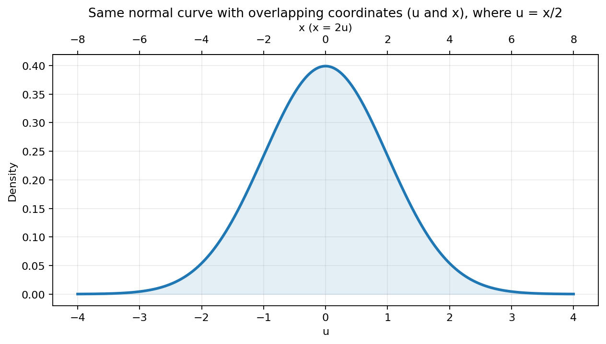

# Basic nature of probability and statistics
In short, we can say that Probability tells you how to go from a population to a sample, and statistics tell you how to go from a sample to a population.

Before we start, there's some important mathematical terms we should know:
  * **Population**: A **set** of all the data. For example, a population of a city means all the people in that city is our samples. In short, total data collection we want to discuss.
  * **Sample**: One Randomly selected from population. Of course, you can have many samples ramdomly selected.
  * **Outcome Value**: the value of randomly selected sample.
  * **Expected Value**: Which is the reasonable 'predicted value' of a sample drawn from the population. This value is the sum of all data points multiplied by their respective probabilities of occurrence (it is not the average value of the samples, don't get confused, the concepts are different).

Expected value is derived from Population and Sample. So the only two basic concept ideas are Population and Sample. All the other theories or ideas are came from those two basic concepts.

Before we go further, there's one thing that we need to comfirm or "define", that is **Random**. Yeah! Because probability is based on random events. We can't go further if we have no definition of random.

> [!NOTE]
> Randomness is **Unpredictability** of a sequence. Give you a sequence of numbers(or events) and you have no way to predict what the next number in the sequence will be, then the sequence is random.

But wait! If we have 99% for sure of next number in the sequence will be, can we say it's random? Yeah...but apparently it's not that random compare to for example only 1% for sure of next number would be, right? 99% for sure! We can say it's almost predictable. So we can't just say a sequence is random, we also need to define what is **Degree of Randomness**.

Something is random if it is based on a set of possible events and it cannot be predicted which event will take place. The degree of randomness of a random event increases with the number of possible events in the set. So it is reasonable to say that the outcome of a throw of a six sided die is more random than the outcome of a cointoss.

So the degree of randomness must be highly relavent with the number of possible events $n$. However, $n$ is not very suitable for definition of degree of randomness because when it comes to $n=1$, the degree of randomness should be $0$, not $1$. And moreover, XXXX.

A more natural definition would be **chosing times**. For example, if there is only $1$ event, then the chosing time would be only 0. If there are $2$ events, then the chosing time would be 1 time. If there ar $4$ events, then the chosing time would be 2 times which means you should chose from two events and then chose from two events again. So the chosing time, or so called the divergent time of the random tree should be the definition of degree of randomness we want, not the number of the branches in a node on the random tree.

This is exactly the definition of **Entropy**, which is also the basic idea of Shannon's data theory. In a uniform distribution over $n$ outcomes, the entropy is $log\left(n\right)$. A distribution with higher entropy is considered more random.

degree of freedom [reference](https://www.zhihu.com/question/26720278)


Binomial distribution to Normal distribution
---------------------
Two outcome values of samples. Suppose we are flapping a coin by N times, and want to know how many times it shows head or tails. Suppose we N=3, then there are {head, head}, {head, tail}, {tail, head}, {tail, tail}, 4 combinations(all combinations has the same possibility to shows). {head, tail} and {tail, head}, those two combinations represents 1 head result, so 1 head result has two combinations and this tells that 1 head result is two times possible than 2 heads result or 2 tails result.

Suppose we have P combinations of k heads result for flapping n times, we can write it as 
``` math
P(k) = C^n_k p^k q^{n-k} = \dfrac{n!}{k!(n-k)!}
```

When n goes to infinity, we can have that P(k) would converge to normal distribution. This truth classically prove by **Stirlin formula**. Classically, Stirlin formula was proved by **Wallis formula** which wasn't proved by Wallis himself but only for a guess. So in the first place, I didn't want to use Stirling formula because I don't know how to prove it. 


I have heard that one can use 2d circular symmetry to prove normal distribution. However, it's actually WRONG!
Suppose 
``` math
lim_{n->\infty)} P(n, k) = f(k)
```

We want to prove that f is the normal distribution. Suppose, we have f(k) number of combinations if k times of head happens. And we have f(h) number of combinations if h times of head happens. Suppose we do the two round, the first round is f(k) and second round is f(h). Then what is the number of combinations of those two round together? 

Apparently, according to the combination theory, the total combination number of those two rounds would be 
``` math
f(k)f(h)
```

Now, we have one thing need to be proved or argue, f(k)f(h) is circular symmetry which means f(k)f(h) is the same if k^2+h^2 keep the value. In short, we need to prove this below:
``` math
f(k)f(h) = g(k^2+h^2) = g(r^2)
```

You may think uh~~ this is apparent~ NO! This is not natural at all. Because f(k)f(h) doesn't imply it is circular symmetry. It turns out that you still need the form of f() which is proved by Stirlin formula. But it's actually okay because you can use Stirlin formula confidentially because you don't actually need Wallis formula to prove that, you can use calculus which is proved by myself to prove it and you can check out the calculus note.

So, now everything turns back, we want to find the distribution of 
``` math
C(N, k) = \dfrac{N!}{k!(N-k)!}
```

However, we can't deal with this directly because factorial would be really hard to handle when N goes to infinity. So we take log of it and using stirlin formula to avoid factorial. 
``` math
\ln (C(N, k)) = S(k)
```

And the magic begins here.

We've already talk about Entropy before, when we want to define what Randomness is, we take log of number of microstates or combinations and we get the Entropy. So Entropy is basically just log of combinations. In thermodynamics, when we talks about entropy, we always talk about **TOTAL ENTROPY** of the system which means it counts all the combinations(microstates). 

But here, we are dealing entropy of a **Macrostate** for k. Actually in the information theory and statistics, "entropy" often refers to it rather than total entropy. This is okay and totally reasonable because, first of all, entropy is just a value to describe the randomness of some state, it doesn't have to total image, so it's okay to focus just on a macrostate. And second, the macrostate shows the distribution we want to know here! 

However, here's one more thing that we need to solve here. The entropy of a macrostate would go to infinity if N goes infinity.
``` math
\lim_{N->\infty} \ln (C(N, k)) = \infty
```

The method we are gonna use to solve this called **Normalization** which you may encounter when dealing with wave function in quantum mechanics. Mathematically, they are doing the same thing. Normalization can remove scale and make thing finite without affect the structure of the distribution. All we need to do is dividing the entropy by N. 

For example, the total entropy would be
``` math
\dfrac{\ln (e^N)}{N} = \dfrac{N \ln(e)}{N} = \ln(e)
```

You see the scale is getting removed. And if total entropy is under control, then entropy of macrostate must under control.

However, in here, we need the entropy of a macrostate, not total entropy. Entropy of a macrostate is special because it is a function of N and k, and k is related to N. If you use Stirlin formula to expand it, you'll find that you need two things to do to remove the scale of N. 

The first is
``` math
\dfrac{\ln (C(N, k))}{N} = \dfrac{S(k)}{N} = s(k) = \ln(N) - \dfrac{k}{N} \ln(k) - \dfrac{N-k}{N} \ln(N-k)
```

This is normalization of the scale of the value of the entropy(y-axis), but this is not enough to cancel the effect of N(which means let the function independent to N) because k(x-axis) can go infinity when N goes infinity, so we still need one things to do, then second one
``` math
p = \dfrac{k}{N}
k = pN
s(k) = \dfrac{\ln (C(N, k))}{N} = 
\dfrac{\ln (C(N, pN)){N} = H(p) = 
-p\ln(p)-(1-P)\ln(1-p)
```

This is actually the famous Shannon entropy function H(p).

One thing need to be noted is that p=k/N is actually doing scaling of x-axis. You may not really see what happens, but if I take two type of rescaling examples, you'll see. Suppose we have
``` math
y = f(x) = x^2
u = x/2
y = f(u) = u^2
```

f(x) and f(u) are DIFFERENT! They are not the same thing but structurely looks the same according to their own coordinate. If you draw f(u) based on x, we would find graph of f(u) is wider than graph of f(x). So f(u) is actually a rescaling result of f(x), vice versa.

Here's another type of rescaling
``` math
y = f(x) = x^2
u = x/2
f(x) = f(2u) = g(u) = (2u)^2 = 4u^2
```
f(x) and g(u) are the same, they are describing the same thing but structurely different(rescaling of x-axis) under their own coordinate.

<p align="center">
  
</p>


Multinomial distribution
------------------------
Multiple outcome values of samples. The important fact is that, if we have n outcomes values(or categories) the distribution diagram is n dimensional! In binomial distribution(Bernoullie trial, 1 or 0), if we have 10 tests, we want to know how many times the outcomes value is 1. This is simple combination problem. However, in **trinomial distribution**(0, 1, 2) problem, we want to know how many times the value is 1 or 2! There are two things we want to know. So the diagram would be 3 dimensional.

Why randomness generates "distribution"? The randomness should be totally unpredictable? The key point is that the number of events. [0, 1, 1], [1, 1, 0], [1, 0, 1]. They are all have two 1. However [1, 1, 1] is the only events of three 1.


> [!NOTE]
> The following notes is possibly wrong! Just read but dont' take it too seriously! ------>  The essence of randomness is "unpredictability (uncertainty)". It is impossible to predict what "event" will occur at a certain time and place. This is what we call randomness. However, the reason why there are "patterns" in randomness is that we impose some restrictions on it. For example, if we limit the possible "events" to a few types at a certain time and place, such as rolling a dice where the outcomes are only 1, 2, ...6, this is called "restricting the range of events". This restriction creates boundaries for randomness, leading to "patterns" and "distributions", which are certain "rules" of randomness. But if "randomness" itself has no restrictions, then the events that occur at any time and place are completely without boundaries, meaning any event can happen. Thus, there would be no "patterns", "distributions", or "rules". This is complete randomness—completely unpredictable randomness.

Normal distribution
-------------------


Random walk
-----------
**Random walk** is the reason behind **Diffusion** of particles system. And random walk also makes things very clear that we do need the idea of **standard deviation**. I actually had no idea why we need standard deviation until I learned random walk and matter wave of quantum mechanics.

Suppose we are flapping coin again by N times and notes the result for head means +1, tail means -1. All the possible combination like {+1, -1, +1, .........}, of course, when N comes to infinity,  


temp
----
The Stirlin formula:
``` math
\ln(n!) = \sum_{k=1}^{n} \ln(k) \approx \int_{1}^{n} \ln(x) dx = \Big[x \ln(x) - x \Big]_{1}^{n} = n \ln(n) - n + 1
```


temp2
-----
Example of variable scaling (the first case):
``` math
y = f(x) = x^2
u = x/2
y = f(u) = u^2
```

this is rescaling the x-axis(compress/stretch horizontally)


If we draw f(u) based on x, we would find the graph of f(u) is a wider version of graph of f(x), but the structure is exactly the same. 

In fact, graph of f(x) based on x and graph of f(u) based on u are exactly the same graph, of course, if we set unit x and unit u same length in viewable graph(but they are not the same length, because u=x/2)

Example of variable scaling ( the second case):
In the first case, 
``` math
y = f(x) = x^2
u = x/2
y = f(u) = u^2
```

f(x) and f(u) are DIFFERENT! They are not the same thing but looks exactly the same according to their coordinate.

However, here's another situation that is 
``` math
y = f(x) = x^2
u = x/2
```

and we put u into f(x) to get
``` math
y = f(2u) = 4u^2
```
the graph looks scaling according to both coordinates but they are actually describing the same thing!

<p align="center">
  
</p>


Now, let's turn back to derivation of normal distribution with Entropy. You don't have to use entropy to derive normal distribution. However, it would be more clear and intuitive.

Normally people won't use total entropy(except for thermodynamics) as a context of Entropy but use **entropy per trial** which is (total_entropy/N) as Entropy in context, especially in Statistics.

The idea of (total_entropy/N) is actually **Normalization**. It makes the result finite when N goes to infinity. And it also removing the scale. 

what does "Scale removing" do?

Because number of total Microstates is 2^N for binomial distribution. Entropy of that is just taking log, so

``` math
S = ln (2^N) = N ln(2)
```

So s is independent of N anymore.(And it's finite now)
``` math
s = S/N = ln(2)
```

The normalization idea would be encountered again when dealing with wave function in quantum mechanics. 

(You have heard of **Renormalization** in quantum field theory, they have the same spirit mathematically but with different image. You would study this in future.)

However, of course, we won't get anything with (total_entropy/N) because we want got the distribution of binomial when N goes to infinity. So we actually want to know what C(N, k)/N is, which is the probability density(distribution density here) which should be **normal distribution**.

Again we take log of it, which is making it to entropy, so we can't avoid dealing with factorial.
``` math
 ln(C(N, k))/N
```

This is also a normalization of entropy but especially for a single microstate when k=k.

Wait...what we are doing now? why use "ln" here? 

The reason of this is that we want to know C(N, k)/N but it's really hard to deal with factorial when N goes to infinity. So we log it to get easier dealing with the problem(and using Stirlin formula). And log of microstates is naturally the so called Entropy! So when we log microstates, we are dealing with Entropy actually.


Okay, now, let's turn back. 
``` math
ln(C(N, k))/N
```
The thing above is not good enough, we have already turned the y-axis to finite, but haven't turned the x-axis to finite. Take a good look of k. The value of k is 0~N. And it could go to infinity when N goes to infinity. To avoid dealing infinity with x-axis, we need to normalize x axis as well to remove 
scale and making thing finite. The easiest way is just use transformation below and take it back into

``` math
p = k/N
```

This is pretty much doing the same thing as u=x/2 of the second case. Structurally the same. The different part is that N is not constant and it can go to infinity.

