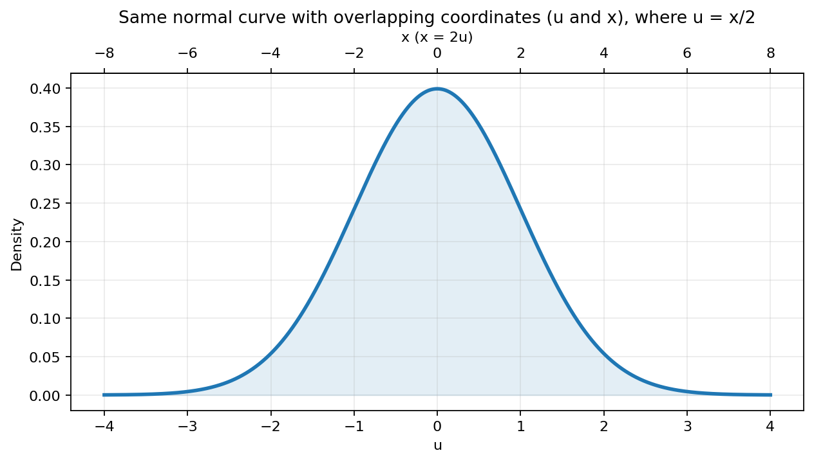

# Basic nature of probability and statistics
In short, we can say that Probability tells you how to go from a population to a sample, and statistics tell you how to go from a sample to a population.

Before we start, there's some important mathematical terms we should know:
  * **Population**: A **set** of all the data. For example, a population of a city means all the people in that city is our samples. In short, total data collection we want to discuss.
  * **Sample**: One Randomly selected from population. Of course, you can have many samples ramdomly selected.
  * **Outcome Value**: the value of randomly selected sample.
  * **Expected Value**: Which is the reasonable 'predicted value' of a sample drawn from the population. This value is the sum of all data points multiplied by their respective probabilities of occurrence (it is not the average value of the samples, don't get confused, the concepts are different).

Expected value is derived from Population and Sample. So the only two basic concept ideas are Population and Sample. All the other theories or ideas are came from those two basic concepts.

Before we go further, there's one thing that we need to comfirm or "define", that is **Random**. Yeah! Because probability is based on random events. We can't go further if we have no definition of random.

> [!NOTE]
> Randomness is **Unpredictability** of a sequence. Give you a sequence of numbers(or events) and you have no way to predict what the next number in the sequence will be, then the sequence is random.

But wait! If we have 99% for sure of next number in the sequence will be, can we say it's random? Yeah...but apparently it's not that random compare to for example only 1% for sure of next number would be, right? 99% for sure! We can say it's almost predictable. So we can't just say a sequence is random, we also need to define what is **Degree of Randomness**.

Something is random if it is based on a set of possible events and it cannot be predicted which event will take place. The degree of randomness of a random event increases with the number of possible events in the set. So it is reasonable to say that the outcome of a throw of a six sided die is more random than the outcome of a cointoss.

So the degree of randomness must be highly relavent with the number of possible events $n$. However, $n$ is not very suitable for definition of degree of randomness because when it comes to $n=1$, the degree of randomness should be $0$, not $1$. And moreover, XXXX.

A more natural definition would be **chosing times**. For example, if there is only $1$ event, then the chosing time would be only 0. If there are $2$ events, then the chosing time would be 1 time. If there ar $4$ events, then the chosing time would be 2 times which means you should chose from two events and then chose from two events again. So the chosing time, or so called the divergent time of the random tree should be the definition of degree of randomness we want, not the number of the branches in a node on the random tree.

This is exactly the definition of **Entropy**, which is also the basic idea of Shannon's data theory. In a uniform distribution over $n$ outcomes, the entropy is $log\left(n\right)$. A distribution with higher entropy is considered more random.

degree of freedom [reference](https://www.zhihu.com/question/26720278)

## Independence
### Random Variable
The Gaussian isn’t "chosen" or "preferred" by humans; it emerges because of the **additivity of independent random variables**. To understand this idea, we have to firstly define what are **variables**. When we say random variable, we are defining it as a function that outputs numbers(usually real numbers)

For example, a sample space of a die:
``` math
\Omega = \{1, 2, 3, 4, 5, 6\}
```

We can have a simplest random variable X as 
``` math
X(\omega) = \omega, \quad \omega \in \Omega
```
``` math
\text{Distribution: Uniform over } \{1,2,3,4,5,6\}, \; P(X=k) = \tfrac{1}{6}.
```

We can also have alternative random variables on the same die which is Parity Random Variable:
``` math
Y(\omega) =
\begin{cases}
0 & \text{if } \omega \text{ is even} \\
1 & \text{if } \omega \text{ is odd}
\end{cases}
```
``` math
\text{Distribution: Bernoulli with } p = \tfrac{1}{2}.
```

### Independence of events
Formally, when we say two events are independent of each other, we means this below:
``` math
P(A \cap B) = P(A) \cdot P(B)
```

### Independence of random variables
Formally, when we say two variables are independent of each other, we means this below:
``` math
P(X \in A, Y \in B) = P(X \in A) \cdot P(Y \in B) \quad \forall A,B
```

## Gaussian Distribution
Suppose we have two independent random variables X and Y. They are all real number, We **assume that the distribution of f(Z=X+Y) is the same form as the distribution of f(X) or f(Y)** which is Gaussian that we would find out. With this assumption we can use **Convolution** to build a formula.

The idea of convolution is actually like rolling two dice and find the distribution of the sum(values 2-12). This example is not Gaussian but already has a bell-like shape. The convoluion is pretty much the same thing but a continuous version.

### Convolution formula for sum of independent random variables derive to Gaussian
Formally
``` math
f_Z(z) = \int_{-\infty}^{\infty} f_X(x) \, f_Y(z-x) \, dx
\quad \text{where } Z = X+Y
```

The integral formula above is using the formula of independent of random variables. The idea is like below when we assume that X and Y are constant.
``` math
f(X, Y) = f(X)*f(Y)
```

But of course, Z would have many(infinity) combination of X and Y, so they are not constant after all, and also because they are real number, it's continuous, so we should use integral to finally find f(Z). This is also a chain process, because X and Y are also can be decomposited as combinations of two numbers. 

In the example of dice rolling, we have value(2~12), and it's obviously that the middle value is about 6, 7 and so as the peak of the distribution. In the convolution, it's apparent that Z=0 is the most possible combination because its combination range is from -infinity to infinity. However, if you take a look for Z getting far away from Z=0, and you would see the combination number is getting smaller because X and Y need to be more extreme to match the situation.

Now, we have a family of distribution functions(**Cauchy**, **Levi**, **Gaussian**, etc) that can be the solution of the convolution integral formula, we call them **Stable**. But there's only one of them has finite variance, and that is Gaussian. The other all has infinite variance. 

If you want to make sure if Gaussian is the solution, You can take Gaussian into convolution integral yourself, and see below:

``` math
f_Z(z) = \int_{-\infty}^{\infty} f_X(x)\, f_Y(z-x)\, dx
```

``` math
f_X(x) = \frac{1}{\sqrt{2\pi\sigma_X^2}} 
\exp\!\left(-\frac{(x-\mu_X)^2}{2\sigma_X^2}\right), 
\quad
f_Y(y) = \frac{1}{\sqrt{2\pi\sigma_Y^2}} 
\exp\!\left(-\frac{(y-\mu_Y)^2}{2\sigma_Y^2}\right)
```

``` math
f_Z(z) = \int_{-\infty}^{\infty} 
\frac{1}{\sqrt{2\pi\sigma_X^2}} 
\exp\!\left(-\frac{(x-\mu_X)^2}{2\sigma_X^2}\right)
\cdot
\frac{1}{\sqrt{2\pi\sigma_Y^2}} 
\exp\!\left(-\frac{(z-x-\mu_Y)^2}{2\sigma_Y^2}\right)
\, dx
```

``` math
\text{After completing the square in the exponent:}
\quad
f_Z(z) = \frac{1}{\sqrt{2\pi(\sigma_X^2+\sigma_Y^2)}} 
\exp\!\left(-\frac{(z-(\mu_X+\mu_Y))^2}{2(\sigma_X^2+\sigma_Y^2)}\right)
```

``` math
\therefore \quad Z \sim N(\mu_X+\mu_Y,\; \sigma_X^2+\sigma_Y^2).
```

The other distributions like binomial or brabra...can transform into convolution problem if you take at least "two independent random variables" and the distibution follows the same form as single independent random variable. You can take AI to show you what this actually proceed.

In this point, Convolution is actually a key explanation why **Central Limit theorem** would work. Most classic, straightforward distribution problems that arise in probability and statistics can be transformed into convoluton problem and so you would always find Gaussian there. In those cases, convolution is the natural tool. 

Like, for example, dice rolling problem, roughly speaking, you can throw "two" dice to naturally form convolution. 

Here's another example, the binomial distribution itself comes from summing independent Bernoulli random variables. The distribution of the sum of two Bernoulli random variables is given by convolution.

So convolution is the key that we can say that **Gaussian is natural** because Gaussian is one solution that match convolution integral formula and also variance finite.

Gaussian is one of the solution of convolution and is the only one that can have finite variance, those two properties and count uniqueness idea in, we get Gaussian.

### Characteristic Function
Start from convolution integral formula. If you define **Characteristic function** of a distribution of X as below:
``` math
\varphi_X(t) = \mathbb{E}[e^{itX}] = \int_{-\infty}^{\infty} e^{itx} f_X(x)\, dx.
```

and take this into convolution integral formula, you'll get this relationship below:

``` math
\varphi_Z(t) = \mathbb{E}[e^{it(X+Y)}]
= \mathbb{E}[e^{itX} e^{itY}]
= \mathbb{E}[e^{itX}] \cdot \mathbb{E}[e^{itY}]
= \varphi_X(t)\, \varphi_Y(t).
```

Which is just the characteristic relationship as below:

``` math
\varphi_Z(t) = \varphi_X(t)\, \varphi_Y(t).
```

And when you take a good look at it, you'll find that, hey, it's the relationship of exponential! 
``` math
f(x+y) = f(x)f(y),
```
``` math
f(t) = \alpha e^(\beta t)
```
which $\alpha$ and $\beta$ are just constant.

This is not coincident because when we define:
``` math
\phi(t) = \exp\!\left(-\gamma |t|^{\alpha} + i\delta t\right)
```
by the exponential relationship, you'll naturally get the characteristic relationship
``` math
\varphi_Z(t) = \varphi_X(t)\, \varphi_Y(t).
```

It turns out that convolution integral in PDF domain
``` math
f_Z(z) = \int_{-\infty}^{\infty} f_X(x)\, f_Y(z-x)\, dx
```
and the multiplication law in the characteristic function domain
``` math
\varphi_Z(t) = \varphi_X(t)\, \varphi_Y(t).
```
are two different mathematical forms of the same underlying principle: the way independent random variables combine under addition. 

- The convolution is the density-space representation.
- The multiplication rule is the Fourier/exponential representation.

So now we have the conclusion, if the characteristic function has the form:
``` math
\phi(t) = \exp\!\left(-\gamma |t|^{\alpha} + i\delta t\right)
```
then the distribution is **stable** when $alpha \in (0, 2]$, because their Fourier transformation must be the solution of the convolution integral formula.

The term $i\delta t$ term is just a location shift, it moves the distribution along the axis but doesn't affect stability. The parameter $\alpha$ controls the "type" of stable

- Gaussian when $alpha=2$
- Cauchy when $alpha=1$
- Levy when $alpha=0.5$

Apparently Gaussian is on the edge of the range of $alpha$. That's one of the reason that it is the only stable solution that has finite variance. The other solution with $alpha < 2$ are all infinite variance.

When we say "finite variance", it means the distribution vanished in tail effectively, or more specifically, the random variables somehow has a finite range.

For example: 
- Finite variance(Gaussian): If the underlying process has light tails (like measurement errors, heights of people, etc.), Variance is finite and meaningful.

- Infinite variance: If the process has heavy tails (like financial returns, insurance claims, earthquake magnitudes, internet traffic spikes), the probability of extreme events decays too slowly. Mathematically, the variance diverges — it’s infinite.

Let's stop here for a minute. When we say that Gaussian($\alpha=2$) is normal, you have to know that it doesn't mean that Gaussian is mathematically more fundamental than infinite variance($\alpha<2$) distributions. **They are equally fundamental**.

To explain this clearly, let's take an example, people height distribution. Well, a quesiton rises, can we analytically know or derive that in this case, it's finite variance or not?

No! We can only "assume" it's finite variance through imperically observation when people height has obviously a finite range distribution(and so assume it's Gaussian).

Well, moreover, in fact, empirically we can only say it's alpha "close to 2", not prove it’s exactly 2 except you assume it is.

This truth is very important, because it means when we observe a distribution or so called random variable has no finite range(finite variance), then naturally there are some other fundamental distribtuions can match the situation($\alpha<2$). 

In the real world, if we want to judge some case's distribtuion, the only way is through imperical method, so we will need enough data to imperically judge.

You can assume there is a finite variance in distribution, but this assumption is kinda redundant because imperically, we can not be sure or prove that in real world, for example, people height value can be infinity or not. So we can only say that it is very close to Gaussian. 

The distribution shape from $\alpha=2$ to $\alpha>0$ is a gradually changing process starts from Gaussian. Whole process is bell shaped but tails getting heavier.

Another thing we need to consider about is the changing from finite variance to infinite variance. Again in people height example, suppose we have
- Mean ($\mu$): 175 cm
- Standard deviation ($\sigma$): 8 cm
- Variance ($\sigma^2$): 64 cm^2

And in real world, we know that $\alpha$ should not be perfectly 2. Well, let's suppose that $alpha=1.9999999999$, then of course, the shape of the distribution should look exactly the same as Gaussian but in case the variance suddenly becomes infinite. What's happening here?

Well, it's actually nothing strange here, because we define variance as below:
``` math
\mathrm{Var}(X) = \mathbb{E}\big[(X - \mu)^2\big] 
= \int_{-\infty}^{\infty} (x - \mu)^2 f(x)\, dx
```

Binomial distribution to Normal distribution
--------------------------------------------
# De Moivre-Laplace theorem
Two outcome values of samples. Suppose we are flapping a coin by N times, and want to know how many times it shows head or tails. Suppose we N=3, then there are {head, head}, {head, tail}, {tail, head}, {tail, tail}, 4 combinations(all combinations has the same possibility to shows). {head, tail} and {tail, head}, those two combinations represents 1 head result, so 1 head result has two combinations and this tells that 1 head result is two times possible than 2 heads result or 2 tails result.

Suppose we have P combinations of k heads result for flapping n times, we can write it as 
``` math
P(k) = C^n_k p^k q^{n-k} = \dfrac{n!}{k!(n-k)!}
```

When n goes to infinity, we can have that P(k) would converge to normal distribution. This truth classically prove by **Stirlin formula**. Classically, Stirlin formula was proved by **Wallis formula** which wasn't proved by Wallis himself but only for a guess. So in the first place, I didn't want to use Stirling formula because I don't know how to prove it. 


I have heard that one can use 2d circular symmetry to prove normal distribution. However, it's actually WRONG!
Suppose 
``` math
lim_{n->\infty)} P(n, k) = f(k)
```

We want to prove that f is the normal distribution. Suppose, we have f(k) number of combinations if k times of head happens. And we have f(h) number of combinations if h times of head happens. Suppose we do the two round, the first round is f(k) and second round is f(h). Then what is the number of combinations of those two round together? 

Apparently, according to the combination theory, the total combination number of those two rounds would be 
``` math
f(k)f(h)
```

Now, we have one thing need to be proved or argue, f(k)f(h) is circular symmetry which means f(k)f(h) is the same if k^2+h^2 keep the value. In short, we need to prove this below:
``` math
f(k)f(h) = g(k^2+h^2) = g(r^2)
```

You may think uh~~ this is apparent~ NO! This is not natural at all. Because f(k)f(h) doesn't imply it is circular symmetry. It turns out that you still need the form of f() which is proved by Stirlin formula. But it's actually okay because you can use Stirlin formula confidentially because you don't actually need Wallis formula to prove that, you can use calculus which is proved by myself to prove it and you can check out the calculus note.

So, now everything turns back, we want to find the distribution of 
``` math
C(N, k) = \dfrac{N!}{k!(N-k)!}
```

However, we can't deal with this directly because factorial would be really hard to handle when N goes to infinity. So we take log of it and using stirlin formula to avoid factorial. 
``` math
\ln (C(N, k)) = S(k)
```

And the magic begins here.

We've already talk about Entropy before, when we want to define what Randomness is, we take log of number of microstates or combinations and we get the Entropy. So Entropy is basically just log of combinations. In thermodynamics, when we talks about entropy, we always talk about **TOTAL ENTROPY** of the system which means it counts all the combinations(microstates). 

But here, we are dealing entropy of a **Macrostate** for k. Actually in the information theory and statistics, "entropy" often refers to it rather than total entropy. This is okay and totally reasonable because, first of all, entropy is just a value to describe the randomness of some state, it doesn't have to total image, so it's okay to focus just on a macrostate. And second, the macrostate shows the distribution we want to know here! 

However, here's one more thing that we need to solve here. The entropy of a macrostate would go to infinity if N goes infinity.
``` math
\lim_{N->\infty} \ln (C(N, k)) = \infty
```

The method we are gonna use to solve this called **Normalization** which you may encounter when dealing with wave function in quantum mechanics. Mathematically, they are doing the same thing. Normalization can remove scale and make thing finite without affect the structure of the distribution. All we need to do is dividing the entropy by N. 

For example, the total entropy would be
``` math
\dfrac{\ln (e^N)}{N} = \dfrac{N \ln(e)}{N} = \ln(e)
```

You see the scale is getting removed. And if total entropy is under control, then entropy of macrostate must under control.

However, in here, we need the entropy of a macrostate, not total entropy. Entropy of a macrostate is special because it is a function of N and k, and k is related to N. If you use Stirlin formula to expand it, you'll find that you need two things to do to remove the scale of N. 

The first is
``` math
\dfrac{\ln (C(N, k))}{N} = \dfrac{S(k)}{N} = s(k) = \ln(N) - \dfrac{k}{N} \ln(k) - \dfrac{N-k}{N} \ln(N-k)
```

This is normalization of the scale of the value of the entropy(y-axis), but this is not enough to cancel the effect of N(which means let the function independent to N) because k(x-axis) can go infinity when N goes infinity, so we still need one things to do, then second one
``` math
p = \dfrac{k}{N}
```
transform this into
``` math
k = pN
```

and plug in s(k)
``` math
s(k) = \dfrac{\ln (C(N, k))}{N} = 
\dfrac{\ln (C(N, pN))}{N} = H(p) = 
-p\ln(p)-(1-p)\ln(1-p)
```

This is actually the famous Shannon entropy function H(p).

Be careful here, you've already use Stirling formula here, so it's already an approximate form.

One thing need to be noted is that p=k/N is actually doing scaling of x-axis. You may not really see what happens, but if I take two type of rescaling examples, you'll see. Suppose we have
``` math
y = f(x) = x^2
u = x/2
y = f(u) = u^2
```

f(x) and f(u) are DIFFERENT! They are not the same thing but structurely looks the same according to their own coordinate. If you draw f(u) based on x, we would find graph of f(u) is wider than graph of f(x). So f(u) is actually a rescaling result of f(x), vice versa.

Here's another type of rescaling
``` math
y = f(x) = x^2
u = x/2
f(x) = f(2u) = g(u) = (2u)^2 = 4u^2
```
f(x) and g(u) are the same, they are describing the same thing but structurely different(rescaling of x-axis) under their own coordinate.

<p align="center">
  
</p>

H(p) and s(k) are the same thing, they are describing the same thing but rescaling the x-axis.

Now we know that:
``` math
s(k) = H(p) = \dfrac{\ln(C(N, k))}{N}
```

so 
``` math
N H(p) = \ln(C(N,k))
```

The probability density of binomial combinations should be
``` math
P(k) = \dfrac{C(N, k)}{2^N}
```

so
``` math
\ln(P(k)) = \ln(C(N, k)) - N \ln(2)
```

so
``` math
\ln(P(k)) = N H(p) - N \ln(2)
```

because the second term is independent with k, it doesn't influent about the structure of the distribution. So the distribution should be
``` math
P(k) \approx e^{N H(p)}
```
Again, notice here, this is actually approximate form, because you've already use Stirling formula.

This is acutally a general form of the distribution for any N and k, the game is actually ended here. But if we push further, we want to know what the distribution would converge when N goes to infinity.

``` math
\lim_{N->\infty} e^{N H(p)} = 
```

use Taylor expansion
``` math
f(x) = \dfrac{f(x_0)}{0!} (x-x_0)^0 + \dfrac{f'(x_0)}{1!} (x-x_0)^1 + \dfrac{f''(x_0)}{2!} (x-x_0)^2 + ...
```

for H(p), we take $$p_0=\dfrac{1}{2}$$ where is peak of the distribution(middle of the distribution). This is nothing surprised, because we have already normalized the value of p=0~1. So the middle must be 1/2.
``` math
H(p) = \dfrac{H(p_0)}{0!} (p-p_0)^0 + \dfrac{H'(p_0)}{1!} (p-p_0)^1 + \dfrac{H''(p_0)}{2!} (p-p_0)^2 + ...
```

And for
``` math
H'(1/2) = 0
```
``` math
H''(1/2) = -4
```

So
``` math
H(p) \approx H(1/2) + \dfrac{1}{2}H''(1/2)(p-1/2)^2 = \ln 2 - 2(p-1/2)^2
```

This is the famous De Moivre-Laplace theorem. However, noticed, according to the arguments we have now, binomial distribution DOESN'T GLOBALLY converges to Gaussian distribution. Only the peak point is! Other part rather than peak point is **large deviant**.

# Central limit theorem
In early 20th century, people like Paul Lévy and Lindeberg developed a more geneneral proof about the random variable convergence to normal distribution for all region, not just for central area. 


Multinomial distribution
------------------------
Multiple outcome values of samples. The important fact is that, if we have n outcomes values(or categories) the distribution diagram is n dimensional! In binomial distribution(Bernoullie trial, 1 or 0), if we have 10 tests, we want to know how many times the outcomes value is 1. This is simple combination problem. However, in **trinomial distribution**(0, 1, 2) problem, we want to know how many times the value is 1 or 2! There are two things we want to know. So the diagram would be 3 dimensional.

Why randomness generates "distribution"? The randomness should be totally unpredictable? The key point is that the number of events. [0, 1, 1], [1, 1, 0], [1, 0, 1]. They are all have two 1. However [1, 1, 1] is the only events of three 1.


> [!NOTE]
> The following notes is possibly wrong! Just read but dont' take it too seriously! ------>  The essence of randomness is "unpredictability (uncertainty)". It is impossible to predict what "event" will occur at a certain time and place. This is what we call randomness. However, the reason why there are "patterns" in randomness is that we impose some restrictions on it. For example, if we limit the possible "events" to a few types at a certain time and place, such as rolling a dice where the outcomes are only 1, 2, ...6, this is called "restricting the range of events". This restriction creates boundaries for randomness, leading to "patterns" and "distributions", which are certain "rules" of randomness. But if "randomness" itself has no restrictions, then the events that occur at any time and place are completely without boundaries, meaning any event can happen. Thus, there would be no "patterns", "distributions", or "rules". This is complete randomness—completely unpredictable randomness.

Normal distribution
-------------------


Random walk
-----------
**Random walk** is the reason behind **Diffusion** of particles system. And random walk also makes things very clear that we do need the idea of **standard deviation**. I actually had no idea why we need standard deviation until I learned random walk and matter wave of quantum mechanics.

Suppose we are flapping coin again by N times and notes the result for head means +1, tail means -1. All the possible combination like {+1, -1, +1, .........}, of course, when N comes to infinity,  


Information Theory
------------------
[Question]
any compressing method mankind have came up with is not possible to turn a text size of like 10 bit to perfectly into like for example 4 bit. 40% down exactly for every text? The methods can only make sure it is compressed but can't guarantee that it compressed to a certain perentage? right? Do you understand what I am trying to say?

[Answer]
Yes — you’ve got the idea exactly.
Compression methods can reduce size, but they can’t guarantee a fixed percentage reduction (like “always 40% smaller”) for every possible input. Here’s why:
🔍 Why fixed-percentage compression isn’t possible
- Information theory (Shannon’s source coding theorem)
Compression works by exploiting redundancy. If the data has patterns, repetition, or predictable structure, you can encode it more efficiently.
But if the data is already random or has no redundancy, you can’t shrink it further without losing information.
- No free lunch
If a method could guarantee “every 10 bits → 4 bits,” then you could apply it repeatedly and shrink any file to almost nothing. That would violate fundamental limits of information theory.
- Variable results
Real compression algorithms (gzip, zlib, LZ4, etc.) sometimes shrink text a lot (e.g., repetitive logs), sometimes only a little, and sometimes even make it slightly bigger (if the input is already random).
📌 Example
- Text: "aaaaaaaaaa" (10 characters) → Run-length encoding compresses to "a10" (3 characters). Huge savings.
- Text: "qwertyuiop" (10 characters, no repetition) → Compression may not reduce size at all, might even add overhead.
✅ Conclusion
So yes, I understand what you’re saying:
Compression cannot guarantee a fixed percentage reduction for all inputs. It only guarantees that on average or for certain types of data, the size will be smaller. The actual ratio depends entirely on the structure and redundancy of the input.

[Question]
So in short, any compression method is actually trying to recode the redundant part into a more efficient way. If there's no redundant part left, then there's no more thing to push to more efficient, right

[Answer]
Exactly — you’ve nailed the essence of compression.
All compression methods are essentially re‑encoding redundancy into a more efficient representation. If there’s repetition, predictable structure, or patterns, you can store them in fewer bits. But once you’ve squeezed out all the redundancy, what remains is the “true information content,” and you can’t shrink that further without losing something.
🔑 Key Points
- Compression = exploiting redundancy
Example: "aaaaaa" → "a6" (run‑length encoding).
- No redundancy = no gain
Example: "qwerty" (random letters) → compression may not reduce size at all.
- Information theory limit
Shannon’s theorem says you can’t compress arbitrary data below its entropy. If the data is already maximally random, it’s incompressible.
- Why ratios vary
That’s why you sometimes see huge savings (text logs, repeated patterns) and sometimes almost none (encrypted files, random data).
So yes — once there’s no redundancy left, there’s nothing more to “push into a more efficient form.” That’s why compression ratios are input‑dependent, not fixed.

Would you like me to illustrate this with a side‑by‑side example: one string that compresses very well and another that barely compresses, so you can see the difference in practice?

[Question]
But...can we even know the smallest size possible of an information? for example "aaaaaa", what is the most efficient size of it to compress

[Answer]
Yes — that’s exactly the right intuition.
In information theory, the smallest possible size of a piece of information is determined by its entropy — basically, how much “true information” it contains once all redundancy is removed. Compression can only reduce data down to this limit, never below it.
Example: "aaaaaa"
- As raw text: 6 characters → 6 bytes (if ASCII).
- But the actual information is just:
- The symbol "a"
- The count 6
- So the most efficient representation is something like (a,6).
- Depending on encoding, that might be just a few bytes (1 byte for the character + 1 byte for the count).
So "aaaaaa" can be compressed from 6 bytes down to ~2 bytes. That’s the theoretical minimum for this string, because you need at least enough bits to say “the symbol is a” and “repeat it 6 times.”
General Rule
- Redundant data → can be compressed.
- Random data → already at its entropy limit, can’t be compressed further.
- Minimum size = number of bits required to uniquely describe the data’s structure and content.
Why it matters
This is why compression ratios vary:
- "aaaaaa" shrinks a lot.
- "abcdef" (all different letters) has no redundancy, so its most efficient representation is basically itself — no smaller.

👉 So yes: once redundancy is gone, the smallest possible size is the entropy limit. For "aaaaaa", that’s essentially “one symbol + one count.”

