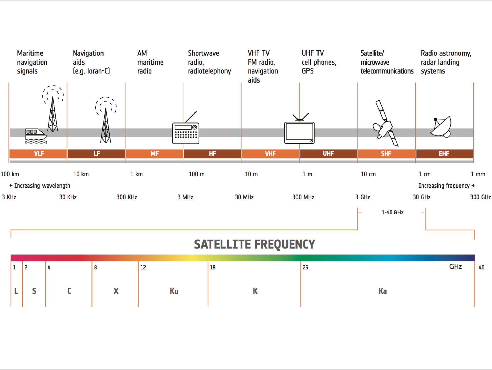

# outline 
  * Satellite's Usage
  * Satellite's Orbit
  * Satellite Spot, Footprint(Receiving Zone)
  * Signal Frequency
  * Receiving Station, Satellite Dish
  * Satallite Lauching

# Satellite's usage
Satellites are for some tasks or jobs when it's better doing at very high place or even outer space. Here's some usual usage:
  * **Communication**:
    * **Starlink by SpaceX**: Provides global broadband internet access.
    * **OneWeb**: Aims to deliver internet connectivity to remote areas.
    * **Intelsat**: Offers commercial telecom services.
  * **Navigation**:
    * **GPS (Global Positioning System)**: Operated by the United States.
    * **GLONASS**: Russia's global navigation satellite system.
    * **Galileo**: The European Union's satellite navigation system.
    * **BeiDou**: China's navigation satellite system.
  * **Earth Observation and Remote Sensing**:
    * **Landsat 9**: Continues the legacy of Earth observation with high-resolution imagery.
    * **Sentinel satellites**: Part of the European Copernicus program for environmental monitoring.
    * **Planet Labs**: Provides daily satellite imagery for various applications.
  * **Weather Forecasting**:
    * **GOES-R series**: Geostationary Operational Environmental Satellites providing real-time weather data.
    * **Polar Operational Environmental Satellites (POES)**: Monitor global weather patterns.
  * **Space Science**:
    * **James Webb Space Telescope (JWST)**: Explores the universe with unprecedented clarity.
    * **Hubble Space Telescope**: Continues to capture stunning images and data from space.
    * **Mars Rover Perseverance**: Searches for signs of ancient life on Mars.
  * **Military and Defense**:
    * **GPS IIF satellites**: Enhance military navigation and timing.
    * **Defense Meteorological Satellite Program (DMSP)**: Provides weather data for military operations.
    * **Advanced Extremely High Frequency (AEHF) satellites**: Enhance secure communication for military forces.
  * **Telemedicine**:
    * **Medicosat**: Provides telemedicine services in remote and underserved areas.
    * **Satmed**: Uses satellite technology to support healthcare in developing countries.
  * **Agriculture**:
    * **Sentinel-1**: Monitors crop health and agricultural practices.
    * **Landsat 8**: Assists in precision agriculture and crop monitoring.
    * **EOS Data Analytics**: Provides satellite-based solutions for precision agriculture.
  * **Banking and Finance**:
    * **Swift Satellite**: Facilitates secure financial transactions and communication.
    * **Intelsat**: Supports global banking and financial services.
    * **Euroclear**: Utilizes satellite communication for secure financial transactions.
  * **Transportation**:
    * **Aireon**: Provides real-time air traffic surveillance using satellite data.
    * **Inmarsat**: Supports maritime communication and navigation.
    * **Iridium satellite constellation**: Provides communication coverage for aviation and maritime industries.
  * **Environmental Monitoring**:
    * **Copernicus Sentinel-5P**: Monitors air quality and pollution levels.
    * **Aura**: Studies Earth's ozone layer, air quality, and climate change.
    * **Jason-3**: Monitors sea surface height and ocean circulation.

# Satellite's Orbit
Satellite's orbit follows physics, which is **Kepler's Planet Motion** here.(We don't use relativity here because most satellites's speed is small enough compare to speed of light.)

Generally, after launch, a satellite should and would keep their own orbit the same. This is physics, and also is the goal of satellite. Every satellite has their own certain task. The stable orbit is good for tracking and maintain the task.

To describe their stable orbit, in Space Engineering/Celestial Mechanics, people use **Orbit Elements** to uniquely identify a specific orbit. These elements are considered in two-body systems using a Kepler orbit.

# Satellite's Orbit type
## LEO(Low Earth Orbit)
Today, most satellites are actually in LEO whose orbit is much closer to Earth (160-2,000km), move quickly, and provide low-latency communication but require large constellations. Best for fast, low-latency internet and detailed Earth imaging, but needs hundreds or thousands of satellites together to work.
## GEO(Geostationary Earth Orbit)
The orbit is much higher(35,786km), appear fixed over one spot, and cover wide areas but with higher latency. The distance of 35,786km is a fixed number because of the law of gravity. In this high of distance, the circular speed is conincidently match the rotational speed of earth. 
According to the law of gravity, the orbital radius uniquely determines the orbital speed, so the speed of satellites(or any object) determined by it's distance from earth if their orbital is circular(ellipitacal is similiar situation). 
## Geosynchronous Satellite

Keplerian elements
------------------
The traditional orbital elements are the six Keplerian elements. 

Two elements define the shape and size of the ellipse:
  * **Eccentricity($e$)**: shape of the ellipse, describing how much it is elongated compared to a circle (not marked in diagram).
  * **Semi-major axis($a$)**: half the distance between the apoapsis and periapsis. The portion of the semi-major axis extending from the primary at one focus to the periapsis is shown as a purple line in the diagram; the rest (from the primary/focus to the center of the orbit ellipse) is below the reference plane and not shown.

Two elements define the orientation of the orbital plane in which the ellipse is embedded:
  * **Inclination($i$)**: vertical tilt of the ellipse with respect to the reference plane, measured at the ascending node (where the orbit passes upward through the reference plane, the green angle $i$ in the diagram). Tilt angle is measured perpendicular to line of intersection between orbital plane and reference plane. Any three distinct points on an ellipse will define the ellipse orbital plane. The plane and the ellipse are both two-dimensional objects defined in three-dimensional space.
  * **Longitude of the ascending node**($\Omega$): horizontally orients the ascending node of the ellipse (where the orbit passes from south to north through the reference plane, symbolized by ☊) with respect to the reference frame's vernal point (symbolized by ♈︎). This is measured in the reference plane, and is shown as the green angle $\Omega$ in the diagram.

The remaining two elements are as follows:
  * **Argument of periapsis($\omega$)**: defines the orientation of the ellipse in the orbital plane, as an angle measured from the ascending node to the periapsis (the closest point the satellite body comes to the primary body around which it orbits), the purple angle ω in the diagram.
  * **True anomaly (ν, θ, or f) at epoch (t0)**: defines the position of the orbiting body along the ellipse at a specific time (the "epoch"), expressed as an angle from the periapsis.

This is not random, in the mathematical sense, we do need six independent parameters to uniquely describe an orbit in 3D.

Here's a picture show what every parameters represent in geometric way:

  

Figure_1

Two line elements
-----------------

Keplerian elements is for ideal orbits. For real world, we need to consider "perturbation". **Two line elements(TLE)** format are created by NASA/NORAD and is most used format today. Based by Keplerian elements, TLE add some "perturbation" elements to describe orbit more accurately for the real world. It also includes some idea of "numerical integral"

Orbital positions can be calculated from TLEs through simplified perturbation math models (SGP4/SDP4/SGP8/SDP8).

# Satellite Spot, Footprint(Receiving Zone)
Satellite's signal is not sphereical wave or omnidirection because of several reasons. 
  * **saving power**
  * **reducing interference** from other satellites or terrestrial sources. 
  * **[frequency reuse(increased capacity)](https://www.geeksforgeeks.org/frequency-reuse/)**.
  * **Better beamforming**
  * **Power efficiency**
  * **Ortal slot usage**
  * **User density**
  * **Cost and complexity**

Generally, Satellites use directional signal(beam), the antennas in it would focus the signal into a specific area or range of directions, creating what we call a **spot beam**.

  

Figure_2

A spot beam's coverage on earth we called it **footprint**. A footprint area is actually the same thing as so called **receiving zone**, the difference is that receiving zone is term in perspective of recevier, footprint is a term in perspective of satellite.

  

Figure_3

The receiver would get the satellite signal area as a circular-like area. However, from satellite's view point, the area it covers is actually a "track" because satellites is flying cross the earth like Figure_3 shows.

# Earth Coverage Beam
This is actually the earth area that a satellite can "see". The edge of the beam is actually the tangent line to earth. And this idea is relative, for the satellite, it's all the area that it can see, for the observers on earth, it is also the area, that observers can see on the sky. Geomestrically, view of the satellite and view of observer are same thing, just different relative reference frame. This means if satellite can see the observer then the observer can see the satellite, vice versa, if the satellite can not see the observer then the observer can't see the satellite according to geometry.

The Figure

  

Earth Coverage Beam is used in Most GNSS(GPS/Galileo/BeiDou), LEO(for science, atmosphere science, remote sensing) or some Amatuer satellites(like CubeSat).

Some modern LEO doesn't use it like Starlink/OneWeb/Kuiper because they need point to point with high data flow.

# Polarization
EM wave has polarization. Linear, circular or ellipse. The satellites emit their signals with polarization. Antennas would have their receiving polarization as well, and it should be setup on feed. For antennas with two axis like X/Y-Antenna or Az/EL-Antenna, they are enough to let their view to any angle in 3D. However, the problem is that the feed's polarization may not be fitted when antenna rotating with receiving signal because feed would spin simultaneously as well. 

You can imagine that antenna receiver's polarization as a ellipse hole, and only the same shape of ellipse thing with right angle can go through it, even the shape is fitted but got fail without right angle(of course circle can handle all ellipse, so it's an exception)

So, in this situation, some antennas would have **Train** axis to handle this. The train is actually just an axis to make feed spin to let the receiving ellipse to the right angle(or at least, do the best as it can)

# Signal Frequency
In the earlier, satellite's signal usually using low frequency(mostly L-band) becacuse of good ionospheric penetration, atmospheric propgation. But low frequency means low bandwidth which means low data capacity. Modern designs tend to use higher frequency. Here's the spectrum satellites use:
  * **L-band(1-2GHz)**
  * **S-band(2-4GHz)**
  * **C-band(4-8GHz)**
  * **X-band(8-12GHz)**
  * **Ku-band(12-18GHz)**
  * **K-band(18-26GHz)**
  * **Ka-band(26-40GHz)**

  

Figure_4

# Receiving Station, Satellite Dish
Satellite dish on receiving station is just like telescope, it need to point to the object on the sky to receive the signal. And because the satellite is a small target on sky, you need to very accurately track the satellite. It's kinda like you use telescope to observe a star. The star is so small that it would easly out of the view zone if there's small direction off. Satellite dish follow the same condition, it is just like telescope use visible light, satellite dish use other range of EM. 1 degree off may cause 3db loss of signal.

Of course, Receiving Station can't magically know where the satellite is, it use orbit parameters of that satellite gave by satellite company. Satellite company would keep tracking the position of their own satellites whose motion are ruled by physical law.

# How a satellite antenna works, generally?
## Axises of Antenna
[x/y Antenna example](https://www.youtube.com/watch?v=NTM8705T4DQ)
### One axis
In one axis, An one‑axis antenna can only rotate around a single axis of motion. That means it has one degree of freedom. The simplest mounts, they’re limited in coverage.

# Reference
[How much can a satellite see earth?](https://www.wtamu.edu/~cbaird/sq/2013/05/10/since-one-satellite-can-see-half-of-the-earth-why-do-we-need-more-than-two-satellites-in-a-given-network/)
